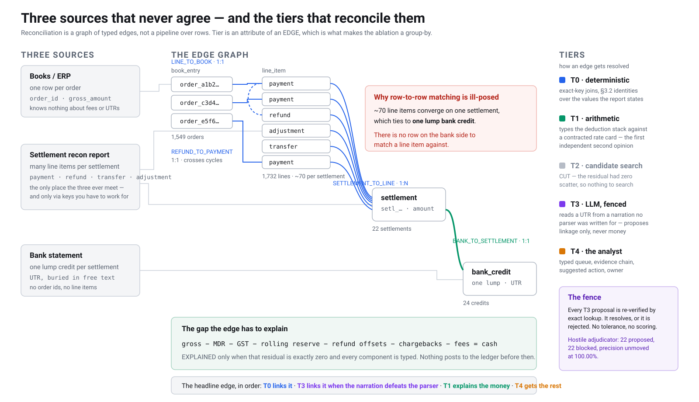

# ARCHITECTURE

Written so a technical reviewer can **check the design decisions independently** rather than take
them on trust. Every claim below points at a file, a test, or a number you can reproduce.

It supports the video; it does not replace it. [README.md](README.md) has the measured results in
full, [PLAN.md](PLAN.md) has every decision with what it ruled out, [RUN_LOG.md](RUN_LOG.md) has the
numbers as they were measured at each gate.

```bash
git clone <repo> && cd ai-finance-controller
python -m venv .venv && .venv/Scripts/activate
pip install -e ".[dev]"          # pydantic + pytest, nothing else
python -m recon demo             # dev seed, ~50 s from a cold clone
python -m recon eval             # the held-out seed
python -m recon ablation --seed eval
pytest                           # 184 tests
```

No network, no API key, no `make`, no `uv`. The LLM is opt-in (`--llm`).

---

## The whole system in one picture



Three sources on the left, the typed edge graph in the middle, the tiers on the right. The two things
to take from it before reading further:

**The fan.** Roughly seventy line items converge on one settlement, which ties to one lump bank
credit. That is why row-to-row matching here is not merely inaccurate but **ill-posed** — there is no
row on the bank side to match a line item against.

**The colours are tiers, and they sit on edges rather than on rows.** The headline edge is linked by
Tier 0, or by Tier 3 when the narration defeats the parser, and then explained by Tier 1. Sections 2
and 3 are that sentence in detail.

*(Vector, so it scales cleanly for the video's opening frame. Presentation is set with attributes
rather than a stylesheet, because markdown sanitisers strip `<style>` and it would render as black
boxes.)*

---

## 1. The grain model — why not a pipeline over rows

**The claim:** reconciliation here is a graph of typed edges between units drawn from three sources,
not stages over a flat row stream.

**Why a row-pipeline was rejected.** The bank does not have rows to match against. One lump credit
corresponds to *many* settlement line items, so "match row to row" is not merely inaccurate — it is
**ill-posed**. And Tier 0 alone spans three different joins at three different cardinalities:

| Edge | Cardinality | Natural key | Bears variance? |
|---|---|---|---|
| `BANK_TO_SETTLEMENT` | **1:1** | `settlement_utr`, buried in free text | yes — gross vs cash |
| `SETTLEMENT_TO_LINE` | **1:N** | `settlement_id` | no — membership only |
| `LINE_TO_BOOK` | **1:1** | `order_id` | yes — ERP vs gateway |
| `REFUND_TO_PAYMENT` | 1:1 | `payment_id`, may cross cycles | no |

Blurring those into one "match rate" makes the denominator indefensible, which §7 names as the
easiest way to lose a technical panel. Each grain carries its own denominator instead.

**Two consequences worth checking:**

*The rollup identity is a property of the edge SET, not of any edge.* `settlement.amount = Σcredit −
Σdebit` is checked over all members at once (`resolve/tier0.py`), which is why `SETTLEMENT_TO_LINE`
is marked `bears_variance=False` — a line either belongs or it does not.

*An exception's subject is a unit **or** an edge* (D-002). "This settlement has no bank credit at all"
is the **absence** of an edge, and absence carries no evidence to hang on one. This is the most common
break shape in real reconciliation, so a pure edge model would have been wrong in the field, not just
inconvenient here.

**Verify:**
- `src/recon/domain/graph.py` → `EDGE_SPECS` — the denominators are machine-readable, not buried in
  report code.
- `test_every_edge_kind_declares_its_grain` — every kind must declare a natural key.
- `test_membership_edge_may_be_explained_without_one` — membership edges carry no decomposition.

---

## 2. The tier system — and the ablation as evidence

**Tier is an attribute of an edge, never of a row.** That single choice is what makes the §7 ablation
a `group by` over edges we already have, rather than a second run with features switched off. A table
produced by re-running can drift from the run it describes; this one cannot.

| Tier | Accountable for | Boundary |
|---|---|---|
| **0** | Exact-key joins; §3.2 identities over values the report *states*; flags, dates, cardinality | Reads reported `fee`/`tax`. Cannot say you were overcharged. |
| **1** | Types the whole §3.3 deduction stack against a contracted rate card; detects off-contract fees | First tier with a *second, independent opinion* (`domain/rates.py`). |
| **2** | Corroborates an unmatched credit on exact `(amount, value_date)`; refuses every tie | Deterministic, not fuzzy. Subset-sum stays cut (D-016, D-027). |
| **3** | Extracts a UTR from a narration no parser was written for | Proposes linkage only. Never touches money. |

### The ablation

| Cumulative | dev | eval (held out) |
|---|---|---|
| T0 · narration join | **0.00%** (0/24) | 0.00% (0/24) |
| + T1 · arithmetic | **83.33%** (20/24) | 0.00% (0/24) |
| + T2 · (amount, date) corroboration | 83.33% | **83.33%** (20/24) |
| + T3 · LLM | 83.33% | **83.33% — adds nothing** |

**Tier 0 alone explains nothing on realistic data.** It finds the counterparty and proves the report
is internally consistent — genuinely useful — but on a merchant with a rolling reserve it explains not
one rupee of the gross-to-cash gap. Increment 0's 100% was a fact about clean data, not about the
resolver.

Two subtleties a reviewer should push on:

**An edge counts at tier N only if *both* its linkage and its explanation are within N.** Tier 3 can
propose a link that Tier 1 then explains; crediting that to Tier 1 would make the LLM look useless by
construction. Edges carry `linked_by` separately from `tier` (D-021).

**`MDR_SLAB_MISMATCH` does not move the residual.** Tier 0 builds its MDR component from the fee
*actually charged*, so an overcharge is internally consistent and still sums to zero. It is
recoverable money, not unexplained money — the one case where a fully explained settlement legitimately
still carries a break.

### How the false-clear metric is kept honest

Every exception class declares `detectable_at`, the lowest tier that can flag it; `BUILT_TIER`
declares how far this build actually goes. False clear splits into **in-remit** (a break the built
resolver was accountable for and silently passed — **must be zero**, and is: 0/192 dev, 0/184 eval)
and **out-of-remit** (needs a tier that does not exist; nothing was cleared, nothing looked).

Without a guard this split would be a way to relabel real misses, so:

**Verify:**
- `test_each_tier_covers_the_remit_it_declares` — a class marked `detectable_at == N` must actually be
  raised by tier N's module. Not "somewhere in the resolver" — that specific tier.
- `test_built_tier_matches_the_tiers_actually_wired_in` — `BUILT_TIER` cannot run ahead of the code.
- `test_no_false_clears_within_the_built_tier_remit`
- `metrics.json` → `ablation`, computed as a filter over edges.

---

## 3. The fence — what the LLM may and may not do

**May:** propose a UTR extracted from one bank narration.
**May not:** choose between candidate settlements, explain a residual, touch an amount, or see
anything except the free text. It is not given the credit amount, the date, or a list of valid UTRs —
handing it valid UTRs would let it "extract" one it never read, and the verifier could not tell the
difference.

Every proposal is re-verified by **exact lookup**. A UTR either resolves to a known settlement or it
does not: no tolerance, no scoring, nothing for a confident wrong answer to win. An accepted edge is
`MATCHED`, not `EXPLAINED` — Tier 1 still has to explain the money before anything posts.

### Finding 1 — the fence holds under attack

A deliberately hostile adjudicator returns well-formed, plausible, **wrong** UTRs with grounded-sounding
rationales.

**22 proposed, 22 blocked, 0 edges created, linkage precision unmoved at 100.00%, statement still
foots.** A fence that rejects everything is a wall, so the control matters too: a truthful adjudicator
*is* accepted.

`test_a_hostile_adjudicator_is_blocked_completely` ·
`test_linkage_precision_is_unmoved_by_a_hostile_adjudicator` ·
`test_a_truthful_adjudicator_is_accepted_so_the_fence_is_not_a_wall`

### Finding 2 — the verifier is necessary and *not sufficient* (D-023)

The gate blocks wrong answers. It does **not** block a *correct* answer to an ambiguous question.

Tier 0 refuses to link a UTR carried by two credits, because picking one is a coin flip presented as a
fact (D-014). An adjudicator reading that same duplicated UTR is not hallucinating — it is right — so
the lookup succeeds and Tier 3 would make exactly the link Tier 0 declined.

Measured cost of not having the second guard: **linkage precision 99.97% and a statement that no
longer foots.** It surfaced only because both are asserted, not just the block count.

**"The model was correct" and "the action was safe" are different questions, and only the second one
matters at the gate.**

`test_a_correctly_read_but_ambiguous_utr_is_still_refused`

### Finding 3 — the LLM adds nothing over the deterministic tiers, and we published that

Measured live, post-audit, with Tier 2 in place:

| | rules only | + adjudicator |
|---|---|---|
| Explanation rate (eval) | 83.33% (20/24) | **83.33% (20/24)** |
| Adjudicator calls | 0 | **2** |
| `blocked_hallucination` | 0 | 0 |
| Linkage precision, bank grain | 20/20 | 20/20 |

Corroboration places 20 of 22 credits first, so the model is asked **2 questions instead of 22**, and
moves the result by **zero**.

**That is the stronger claim, not the weaker one.** We looked for the LLM's job, found a deterministic
rule that does it better on our own data, published the comparison, and cut the model to the residue.

*Before* Tier 2 existed, three runs over all 22 narrations returned 5, 3 and 4 correct, and we
published the range rather than the best sample — *quoting 62% alone would be quoting the better
sample*. That discipline stands and the run is preserved in RUN_LOG.md. Its denominator, however, was
inflated by the defect Tier 2 fixed, so it is history rather than the headline.

**What did not move, through any of it:** linkage precision at the bank grain, 100.00%, including
under a hostile adjudicator returning 22 plausible wrong UTRs — all blocked. The LLM is *allowed* to
be unreliable. That is the design.

### Where determinism stops

Same seed ⇒ byte-identical `metrics.json` for the shipped rules-only path and any deterministic
adjudicator (both tested). **Not** with a live LLM — the response cache is per-run (D-026). Stated
here rather than left for a reviewer to find.

---

## 3a. Monotonic exclusion — a principle found the hard way, twice

**The claim:** *a tier may add explanation. It may never widen the candidate set, relax a gate, or
contradict a fact a lower tier has already established from the sources. A constraint established at
tier N holds at every tier above N.*

This is not a design note written in advance. It is the shape of two defects found on 02 Sep, one
day apart, in two different tiers:

| | What happened | Cost, measured |
|---|---|---|
| **F-016** | Tier 0 marks a bank edge explained only when the decomposition closes **and** the credit ties out to the settlement's reported total. Tier 1 recomputed that as the first conjunct alone, then overwrote the status. | Journal entries posted for two settlements per seed whose own report contradicted the bank, at Rs 2,238.57 and Rs 3,121.71 |
| **F-017** | Tier 0 reads `status` and queues a non-`processed` settlement as `SETTLEMENT_FAILED` — the money never left. Tier 2's candidate pool never consulted `status` and corroborated a credit against one anyway. | eval false clear **0.00% -> 0.53%**, linkage precision **100.00% -> 99.97%** — the first movement in either, ever |

**The structural cause is in the grain model, and it is worth a reviewer's attention.** `ReconEdge`
lets any tier overwrite an edge's `status`, and **nothing carries forward what an earlier tier
concluded about a *unit***. Tier 0 knows "this settlement failed" and "this credit does not tie out";
that knowledge lives only inside exception records, which no later tier reads. Both defects are that
one gap, reached from opposite directions — and the same gap is why both were invisible to a green
test suite.

**Why both were undetectable until 02 Sep.** Neither could be triggered by any data the generator
could produce. `settlement.amount` was computed from the line items the resolver re-sums, and the bank
credit was copied from it, so the tie-out could not fail; `status` was hard-coded to `"processed"`, so
the exclusion never existed. Two of the acknowledged simplifications in §4 were not cosmetic. They
were holding two live defects out of reach of every test in the suite.

> **An identity that cannot fail is not a passing test. It is an untested region with a green light
> over it.**

**How it is guarded.** Each instance has a parametrised regression test asserting the *property* —
"nothing posts while the report disagrees with the cash", "no credit links to a settlement that never
paid out" — rather than a count, so they survive a change in injection rates. Those pin the two known
instances. The general guard is the **tier-prefix differential** (§3b): the pipeline is re-run at each
tier prefix and neither linkage precision nor in-remit false clear may worsen as a tier is added. It
needs no predicate written in advance, which is the property that matters for the third instance.

### 3b. The tier-prefix differential — the guard for the instance we have not found yet

`pipeline.run` takes a `max_tier`, so the same data can be resolved with successively more of the
resolver switched on. Two properties are then asserted across every adjacent pair of prefixes, on
**both** seeds:

| Assertion | The failure it names |
|---|---|
| The count of **wrong links** may only go down | a tier widened the candidate set into an edge a lower tier correctly refused |
| A **real break flagged at prefix N is still flagged at prefix N+1** | a tier explained away something real |

Neither needs a predicate written in advance, which is the property that matters: the third instance
will be in a tier that does not exist yet. A third assertion checks that the prefix runs actually
differ, so the guard cannot pass vacuously if a refactor ignores `max_tier` — the F-011 failure one
level along.

**It was validated by re-introducing F-017 rather than by reasoning about it.** With both fixes
reverted and the seeds regenerated, it fails on the held-out seed with:

```
eval: tier 2 silenced 1 real break(s) that tier 1 had flagged: ['bc_1582830180d']
```

**What it does not cover, stated plainly.** It would not have caught F-016, which produced no wrong
link and silenced no exception — it marked an edge explained that should not have been, and only the
tie-out predicate sees that. A guard whose blind spot is documented is worth more than one whose
limits are unexamined.

Note that `metrics.json`'s ablation table is still a **group-by over edges, not a set of re-runs** — a
table produced by re-running can drift from the run it describes. `max_tier` exists for the guard,
which needs genuine prefixes because the failure it hunts is a later tier acting on the graph at all.

**Verify:**
- `test_tier1_does_not_post_a_settlement_whose_report_contradicts_the_bank`
- `test_corroboration_never_links_a_settlement_that_never_paid_out`
- `test_a_failed_settlement_is_never_also_double_posted`
- `test_no_tier_introduces_a_wrong_link` · `test_no_tier_silences_a_break_an_earlier_prefix_found`
- `test_the_prefix_runs_actually_differ`

---

## 4. Honest absences

Not oversights. Each is a dated decision recording what it ruled out.

| Absent | Why | Decision |
|---|---|---|
| **Subset-sum search** | Increment 1 measured the residual as 100% typed with **zero scatter** — nothing for a search to search. Building difficulty *to justify* the LLM is the §9 anti-pattern. Tier 2 now exists, but as exact corroboration, not search. | D-016, D-027 |
| **Multi-gateway collision** | Held as the ambiguity "lever" from 25 Aug, then cut outright rather than manufacture difficulty. | D-016 |
| **Second merchant scenario** | Doubles generator surface, produces no new *break shape*; a card-heavy merchant's difficulty fits inside one merchant's method mix. | D-011 |
| **FX / international** | A second currency threaded through the money type, to buy one exception code. | D-011 |
| **TDS 194-O** | Out by merchant persona — monthly-grain, seller-level, reconciled to Form 26AS. A second sub-recon at a different grain. | Assumption 1 |
| **Third rate-card seed** | Would upgrade "generalises across worlds" to "across contracts". 1–2 h, fixes nothing broken. | D-024 |
| **Cross-run LLM cache** | Would make `--llm` runs reproducible. The demo and every gate run the deterministic core. | D-026 |

The taxonomy is disciplined the same way: `CHARGEBACK_FEE_UNBOOKED` and `PARTIAL_SETTLEMENT` were
**removed** from `ExceptionType` because the generator cannot honestly produce them (D-013). A
taxonomy entry with no data behind it is a claim we cannot back.

### What the simulator makes easier than reality

Stated because a reviewer will find it. This list was the input to the 02 Sep realism increment: each
entry was ranked for how much it understates real difficulty, three were closed, one was **withdrawn
as factually wrong**, and the rest are named with what they would cost.

#### Closed on 02 Sep, and what each one cost the result

**The bank value date was a copy of the settlement date.** `derive_bank` wrote `settled_on` straight
into `value_date`, while BRIEF §3.4 lists `created_at ≠ settled_at ≠ bank value date` as one of the
two structural difficulties of this domain. A credit now posts on the settlement date or the next
business day, and never on a weekend.

*What it cost:* Tier 2's exact `(amount, value_date)` join collapsed from **18/23 to 4/23** on the
held-out seed. The entire corroboration result had been resting on a field the bank does not restate.
Under the windowed rule (D-033) it returns to **18/23** — because the *amount* is what discriminates,
not the date. Same-day multiple credits now occur, so "no same-day multiples" is no longer true either.

**`status` was hard-coded to `processed`.** One settlement per seed now reports `failed` and produces
no credit. A failed settlement and a missing credit are identical in a bank statement — neither has a
row — and opposite findings: one sends an analyst to the gateway, the other to the bank.

*What it cost:* it exposed **F-017**, Tier 2 corroborating a credit against a settlement Tier 0 had
declared failed in the same run — the first movement in held-out linkage precision (100.00% → 99.97%)
and in-remit false clear (0.00% → 0.53%) in the project's history. Both restored.

**Two §3.2 identities could not fail.** `settlement.amount` was computed from the line items the
resolver re-sums, and the bank credit was copied from it. Two settlements per seed now report a total
struck before one of their own lines posted.

*What it cost:* it exposed **F-016**, Tier 1 marking edges fully explained and **posting journal
entries** for settlements whose own report contradicted the bank. Live since Increment 2 and
undetectable until data could make the tie-out fail.

> An identity that cannot fail is not a passing test. It is an untested region with a green light
> over it. Two of the four entries on this list were holding live defects out of reach of the suite.

#### Withdrawn — this caveat was wrong (D-034)

The 01 Sep list claimed **"a real bank nets its charges out of the credit"**. For an *inbound*
NEFT/RTGS/IMPS credit to an Indian merchant's account, the beneficiary bank does not deduct a charge
from an inward transfer: the settlement amount and the bank credit tie out **exactly**, which is
precisely why a real reconciler can lean on the amount. Modelling the netting would have made this
world *less* like a real settlement flow. The **date** half of the same caveat was real, was closed,
and did change the answer; the **amount** half was not.

#### Still open, with what each would cost

**The UTR format is invented.** `[0-9]{10}[a-z0-9]{6}` matches no real Indian instrument — NEFT UTRs
carry a bank prefix, UPI and IMPS RRNs are 12 digits. The adjudicator's prompt is given that spec, so
the model is told our format rather than having to infer a real one. **3–4 h**, and the highest blast
radius on the list: every UTR changes, so every `bank_ref` (a CRC of it) changes with it. Declined on
02 Sep for time, not on merit — it is the one remaining gap that could move the extraction result in
either direction.

**The narration registry is thin**: five families, two held out. Adding more is cheap, and was
declined deliberately — no realism argument selects *which* new shapes to add, so the choice would be
downstream of "this would give the LLM more to do", which is the reasoning this increment was scoped
to avoid.

**One settlement per 4 days.** A real merchant settles daily. Moving to a daily cycle takes 22 cycles
to 88, breaks the brief's own 15–25 band (§5) and re-baselines every published denominator. The part
of this that mattered — credits sharing a date — arrived anyway through the posting lag.

**An on-demand settlement replaces its cycle's scheduled one** rather than drawing against the pending
balance alongside it, which is what §3.4's "interleave" describes. A larger change to the money model
than the gap named, and out of scope for the increment.

**The remaining §3.2 identity, the bank tie-out, can now fail** — a stale total breaks it, and F-016
was the proof. What is still absent is a credit that arrives *short* of a correct settlement total.
The realistic mechanism for that is a failed transfer re-issued inside the window, which is the
on-demand modelling above.

---

## 5. What we would build next

Ranked by value, with honest cost. This is the difference between *ran out of scope* and *ran out of
time*: everything below is designed for and unblocked, not aspirational.

**1. A third seed on a different rate card — 1–2 h.** The one measurement that would materially
strengthen the strongest claim. Tier 1 currently proves it generalises across *worlds* drawn from the
same rate card; a seed with different constants would prove it across *contracts*, or reveal that
Tier 1 silently closes when it should be reporting mismatches. The rate card is module-level constants
today and would need to become injectable. (D-024 — declined on time, not on merit.)

**2. Persist the adjudicator cache across runs — 30–45 min.** Restores byte-identical runs with
`--llm` enabled, keyed by narration hash. Would collapse the 3–5 range into a reproducible figure.
(D-026.)

**3. A prompt tuned against `dev` narrations — 1 h.** The current prompt was written **blind** and has
never been tuned, deliberately: tuning against held-out results would make the ablation measure our
tuning rather than the model. The disciplined version tunes on `dev` only, then re-measures on `eval`
once.

**4. `RazorpayAPISource` — ~1 h.** The `SettlementSource` protocol (`ingest/source.py`) was built in
Increment 0 precisely so a read-only live adapter is an implementation rather than a refactor. The
seam exists and is unused.

**5. Tier 2, if and only if data demands it.** Not "next" so much as *conditional*: it needs a
residual distribution with genuine scatter, which our generator does not produce and which we declined
to manufacture. On real merchant data, this is the first thing to re-measure.

**What we would not do:** add features to broaden the surface. The submission's argument is one deep
loop measured honestly, and four shallow features is the §9 anti-pattern that would weaken it.
